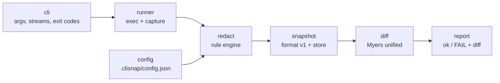

# clisnap

[English](README.md) | [中文](README.zh.md) | [日本語](README.ja.md)

[](LICENSE) [](go.mod) [](CHANGELOG.md)  [](CONTRIBUTING.md)

**clisnap：CLI のためのオープンソース・スナップショットテストツール——実際のコマンド出力を一度だけ記録し、揺らぎを塗りつぶし、再実行のたびにクリーンに diff する。**


```bash
git clone https://github.com/JaydenCJ/clisnap.git && cd clisnap && go install ./cmd/clisnap
```

> プレリリース：v0.1.0 はまだ module proxy のタグを公開していないため、上記の手順でソースからインストールしてください。単一の静的バイナリで、ランタイム依存はゼロ。

## なぜ clisnap？

Web 開発者はテストフレームワークからスナップショットテストを当たり前に手に入れる。一方 CLI 作者はいまだに「golden file」を手作りし、その再承認に人生を費やしている——実際のコマンド出力にはタイムスタンプ、PID、一時パス、ホームディレクトリ、所要時間、アドレスが埋め込まれ、実行のたび・マシンのたびに変わるからだ。よくある対処は病気より質が悪い：テストスクリプトに `sed` パイプラインを継ぎ足すか、何も主張しなくなるまでスナップショットを過激に正規化するか。clisnap は「揺らぎの塗りつぶし」をスナップショット自体の第一級・バージョン管理対象にした：`record` は stdout・stderr・終了コードを捕捉し、揮発的な断片を `<TIMESTAMP>` や `<PID>` のような安定トークンに書き換え、*どの*ルールを適用したかをスナップショット内に保存する——だから `check` はどのマシンでも永遠に同一の正規化を再生し、diff が出たなら挙動が本当に変わったということだ。

| | clisnap | 手作り golden file | cram / prysk | insta-cmd |
| --- | --- | --- | --- | --- |
| 揺らぎの塗りつぶし | 内蔵ルール + カスタム正規表現、スナップショット毎に記録 | 各スクリプトで `sed`/`grep` を自作 | 揮発行ごとに `(re)` マーカーを手書き | Rust コード内でフィルタを設定 |
| テスト対象 | 任意の実行ファイル・任意の言語 | 任意 | 任意 | 任意の実行ファイル（ただし Rust テストコードから駆動） |
| ランタイム依存 | なし（Go 標準ライブラリ、単一バイナリ） | なし | Python + インストール | Rust ツールチェイン |
| 終了コード + stderr の検証 | 常に、かつ分離して | 大抵忘れられる | 終了コードは可 | 可 |
| 意図した変更後の再記録 | `check --update`、失敗分のみ | 手動で上書き | `--interactive` | `cargo insta review` |
| レビューでの可読性 | 行頭プレフィックス付きテキスト、diff 前提の設計 | 生ダンプ | テストファイルに埋め込み | YAML 風ファイル |

<sub>比較は 2026-07 時点の各上流ドキュメントに基づく。cram/prysk の `(re)` マーカーは揮発行ごとに手動保守が必要；clisnap のルールは出力全体に効き、各スナップショットに固定される。</sub>

## 特徴

- **揺らぎ塗りつぶしを標準装備** — タイムスタンプ（RFC 3339・RFC 1123・syslog・裸の時刻）、所要時間、PID、一時パス、ホームディレクトリ、16 進アドレス、UUID、ANSI コードが安定トークンになる；誤爆リスクのあるパターン（裸の日付、epoch 整数）も用意するがオプトイン。
- **マシンをまたいで生き残るスナップショット** — 現在ユーザーの実ホームディレクトリはどんなレイアウトでも塗りつぶされ、各スナップショットは自分のルール一覧を記録するため、アップグレードが古いスナップショットの意味を黙って変えることはない。
- **stdout だけでなく契約全体を検証** — stderr は分離して捕捉され、終了コードも検証対象；出力がストリーム間を移動したり、ステータスコードが退行すれば check は失敗する。
- **読める失敗** — コンテキスト付きの本物の Myers unified diff、git 流の `\ No newline at end of file` マーカー、正しい行を指すハンクヘッダ。
- **レビューのためのフォーマット** — スナップショットはバージョンヘッダ付き・行頭プレフィックス付きのテキストで、コミットしてコードレビューで読む前提の設計；壊れたファイルは行番号付きで拒否され、ゴミ同士の比較にはならない。
- **依存ゼロ・ネットワークゼロ** — 純粋な Go 標準ライブラリ、静的バイナリ 1 個；clisnap はコマンドを実行しファイルを読むだけで、それ以外は何もしない。自身は 90 個のオフラインテストとエンドツーエンドの smoke スクリプトで検証済み。

## クイックスタート

実行のたびに出力が変わるコマンドを記録する：

```bash
cat > greet.sh <<'EOF'
#!/bin/sh
echo "greeter 1.0"
echo "started $(date -u +%Y-%m-%dT%H:%M:%SZ) pid $$"
echo "hello, world"
EOF
chmod +x greet.sh

clisnap record greet -- ./greet.sh
clisnap check
```

実際に捕捉した出力：

```text
recorded greet -> .clisnap/greet.snap (exit 0, 2 redactions)
  redacted: pid×1 timestamp×1
ok      greet
1 snapshot: 1 ok
```

スナップショットはただのテキストファイル——そのままコミットできる。タイムスタンプと PID は消えているので、明日同僚のノート PC で走らせても通る：

```text
clisnap snapshot v1
cmd: ["./greet.sh"]
exit: 0
redact: ansi,tmp-path,home-path,timestamp,uuid,hex-addr,duration,pid
--- stdout: 3 lines ---
|greeter 1.0
|started <TIMESTAMP> pid <PID>
|hello, world
--- stderr: 0 lines ---
```

挙動が本当に変わると、`check` は unified diff と終了コード 1 で失敗する（挨拶文を編集した後の実際の出力）：

```text
FAIL    greet
--- greet.snap stdout
+++ current stdout
@@ -1,3 +1,3 @@
 greeter 1.0
 started <TIMESTAMP> pid <PID>
-hello, world
+hello there, world
1 snapshot: 0 ok, 1 failed
```

意図した変更は `clisnap check --update` で受け入れる。`clisnap redact` に何でもパイプすれば、ルールセットの効果をプレビューできる。

## 内蔵の塗りつぶしルール

| 名前 | デフォルト | 書き換え対象 | トークン |
| --- | --- | --- | --- |
| `ansi` | 有効 | ANSI CSI/OSC エスケープシーケンス | *（除去）* |
| `tmp-path` | 有効 | `/tmp`・`/private/tmp`・`/var/folders`・`/dev/shm` のパス全体 | `<TMP>` |
| `home-path` | 有効 | `/home/<user>`・`/root`・現在ユーザーの実ホーム——末尾パスは保持 | `<HOME>` |
| `timestamp` | 有効 | RFC 3339・RFC 1123・syslog 日付・裸の `HH:MM:SS` | `<TIMESTAMP>` |
| `uuid` | 有効 | RFC 4122 UUID | `<UUID>` |
| `hex-addr` | 有効 | 16 進 4–16 桁の `0x` リテラル（`0xFF` は無傷） | `<ADDR>` |
| `duration` | 有効 | `812ms`・`1.5s`・`1h2m3.5s`（`v1.2s` は無傷） | `<DURATION>` |
| `pid` | 有効 | `pid 123`・`PID: 4`・`pid=77`・syslog `proc[123]:` | `<PID>` |
| `date` | オプトイン | 裸の `YYYY-MM-DD`（安定出力のことが多いため既定では無効） | `<DATE>` |
| `epoch` | オプトイン | 2017–2033 の範囲の 10/13 桁 epoch 整数 | `<EPOCH>` |

ルールは列挙順に関係なく常に同一の正準順で適用され、置換は冪等で、各スナップショットは記録時のルールセットを固定する。詳細と設計判断は [docs/snapshot-format.md](docs/snapshot-format.md) を参照。

## 設定

任意の `.clisnap/config.json`。厳格にパースされる（未知キーはエラー）：

| キー | デフォルト | 効果 |
| --- | --- | --- |
| `redact` | 内蔵デフォルト集合 + 全カスタムルール | 新規記録が使うルール一覧を置き換える |
| `rules` | `[]` | カスタム正規表現ルール（`name`・`pattern`・`replace`）、内蔵より先に適用 |

呼び出し単位の制御：`record --redact pid,uuid` でルールを選択、`record --redact none` はそのまま記録、`record --shell` はパイプライン全体をスナップショット、`--dir` でスナップショットディレクトリを変更。終了コード：`0` 成功、`1` スナップショット不一致（または全体 check でストアが空）、`2` 用法/設定/IO エラー。

## アーキテクチャ



`record` は左から右へ流れてストアで止まる。`check` はコマンドを再実行し、スナップショット自身のルール一覧で塗りつぶした上で、両テキストを differ に渡す。

## ロードマップ

- [x] v0.1.0 — record/check/update/list/show/rm、redact フィルタモード、内蔵ルール 10 個 + カスタムルール、厳格な v1 フォーマット、Myers unified diff、依存ゼロ、テスト 90 個 + smoke スクリプト
- [ ] 暴走コマンド対策の `--timeout` と出力サイズ上限
- [ ] Windows 対応：パス塗りつぶしルール、CRLF 正規化オプション
- [ ] CI 注釈向けの機械可読レポート `check --json`
- [ ] 対話寄りツール向けの stdin フィクスチャ（`record --stdin file`）
- [ ] 出力中の VCS ハッシュを塗りつぶすオプトインの `sha` ルール

全リストは [open issues](https://github.com/JaydenCJ/clisnap/issues) を参照。

## コントリビュート

バグ報告・塗りつぶしルールのアイデア・PR を歓迎——ローカルの手順は [CONTRIBUTING.md](CONTRIBUTING.md)（`go test ./...` に加え `scripts/smoke.sh` が `SMOKE OK` を出力）。入門タスクは [good first issue](https://github.com/JaydenCJ/clisnap/issues?q=is%3Aissue+is%3Aopen+label%3A%22good+first+issue%22)、設計の議論は [Discussions](https://github.com/JaydenCJ/clisnap/discussions) へ。

## ライセンス

[MIT](LICENSE)
