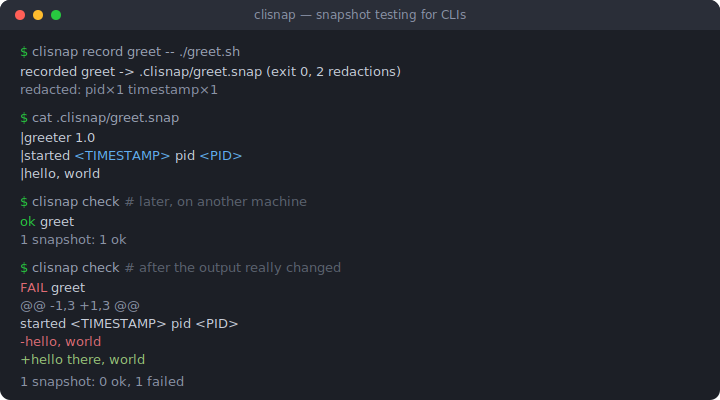
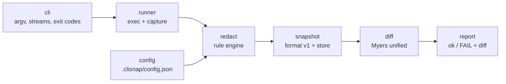

# clisnap

[English](README.md) | [中文](README.zh.md) | [日本語](README.ja.md)

[](LICENSE) [](go.mod) [](CHANGELOG.md)  [](CONTRIBUTING.md)

**clisnap：an open-source snapshot-testing tool for CLIs — record real command output once, redact the volatility, and diff clean on every re-run.**



```bash
git clone https://github.com/JaydenCJ/clisnap.git && cd clisnap && go install ./cmd/clisnap
```

> Pre-release: v0.1.0 is not yet published to a module proxy tag; install from source as above. A single static binary, no runtime dependencies.

## Why clisnap?

Web developers get snapshot testing for free from their test frameworks; CLI authors still hand-roll "golden files" — and then spend their lives re-blessing them, because real command output embeds timestamps, PIDs, temp paths, home directories, durations and addresses that change on every run and every machine. The usual fixes are worse than the disease: `sed` pipelines bolted onto test scripts, or snapshots so aggressively normalized they no longer assert anything. clisnap makes redaction a first-class, versioned part of the snapshot itself: `record` captures stdout, stderr and the exit code, rewrites volatile spans to stable tokens like `<TIMESTAMP>` and `<PID>`, and stores *which* rules were applied inside the snapshot — so `check` replays the exact same normalization forever, on any machine, and a diff means the behavior actually changed.

| | clisnap | hand-rolled golden files | cram / prysk | insta-cmd |
| --- | --- | --- | --- | --- |
| Volatility redaction | built-in rules + custom regex, recorded per snapshot | DIY `sed`/`grep` in every script | `(re)` markers written by hand per line | filters configured in Rust code |
| Tool under test | any executable, any language | any | any | any executable, driven from Rust test code |
| Runtime dependencies | none (Go stdlib, single binary) | none | Python + install | Rust toolchain |
| Exit code + stderr asserted | always, separately | usually forgotten | exit code yes | yes |
| Re-record after intended change | `check --update`, only failing ones | manual copy-over | `--interactive` | `cargo insta review` |
| Snapshot readability in review | line-prefixed text format, designed for diffs | raw dumps | test-file inline | YAML-ish files |

<sub>Comparison reflects upstream documentation as of 2026-07. cram/prysk `(re)` markers must be maintained by hand on each volatile line; clisnap rules apply corpus-wide and are pinned inside each snapshot.</sub>

## Features

- **Volatility redaction built in** — timestamps (RFC 3339, RFC 1123, syslog, bare clock), durations, PIDs, temp paths, home directories, hex addresses, UUIDs and ANSI codes become stable tokens; risky patterns (bare dates, epoch integers) exist but are opt-in.
- **Snapshots that survive machines** — the current user's real home directory is redacted whatever its layout, and each snapshot records its own redactor list, so upgrades never silently change what an old snapshot asserts.
- **The whole contract, not just stdout** — stderr is captured separately and the exit code is part of the assertion; output migrating between streams or a status-code regression fails the check.
- **Readable failures** — real Myers unified diffs with context, git-style `\ No newline at end of file` markers, and hunk headers that point at the right lines.
- **A reviewable format** — snapshots are line-prefixed text files with a versioned header, made to be committed and read in code review; corrupt files fail with positioned parse errors instead of comparing garbage.
- **Zero dependencies, zero network** — pure Go stdlib, one static binary; clisnap runs your command and reads files, nothing else, and its own suite is 90 offline tests plus an end-to-end smoke script.

## Quickstart

Record a command whose output is different on every run:

```bash
cat > greet.sh <<'EOF'
#!/bin/sh
echo "greeter 1.0"
echo "started $(date -u +%Y-%m-%dT%H:%M:%SZ) pid $$"
echo "hello, world"
EOF
chmod +x greet.sh

clisnap record greet -- ./greet.sh
clisnap check
```

Real captured output:

```text
recorded greet -> .clisnap/greet.snap (exit 0, 2 redactions)
  redacted: pid×1 timestamp×1
ok      greet
1 snapshot: 1 ok
```

The snapshot is a plain text file — commit it. The timestamp and PID are gone, so tomorrow's run on your colleague's laptop still passes:

```text
clisnap snapshot v1
cmd: ["./greet.sh"]
exit: 0
redact: ansi,tmp-path,home-path,timestamp,uuid,hex-addr,duration,pid
--- stdout: 3 lines ---
|greeter 1.0
|started <TIMESTAMP> pid <PID>
|hello, world
--- stderr: 0 lines ---
```

When behavior genuinely changes, `check` fails with a unified diff and exit code 1 (real output after editing the greeting):

```text
FAIL    greet
--- greet.snap stdout
+++ current stdout
@@ -1,3 +1,3 @@
 greeter 1.0
 started <TIMESTAMP> pid <PID>
-hello, world
+hello there, world
1 snapshot: 0 ok, 1 failed
```

Accept intended changes with `clisnap check --update`, or pipe anything through the engine with `clisnap redact` to preview what a rule set does.

## Built-in redactors

| Name | Default | Rewrites | Token |
| --- | --- | --- | --- |
| `ansi` | yes | ANSI CSI/OSC escape sequences | *(removed)* |
| `tmp-path` | yes | `/tmp`, `/private/tmp`, `/var/folders`, `/dev/shm` paths, whole | `<TMP>` |
| `home-path` | yes | `/home/<user>`, `/root`, and the current user's real home — keeps the tail | `<HOME>` |
| `timestamp` | yes | RFC 3339, RFC 1123, syslog dates, bare `HH:MM:SS` | `<TIMESTAMP>` |
| `uuid` | yes | RFC 4122 UUIDs | `<UUID>` |
| `hex-addr` | yes | `0x` literals of 4–16 hex digits (`0xFF` survives) | `<ADDR>` |
| `duration` | yes | `812ms`, `1.5s`, `1h2m3.5s` (`v1.2s` survives) | `<DURATION>` |
| `pid` | yes | `pid 123`, `PID: 4`, `pid=77`, syslog `proc[123]:` | `<PID>` |
| `date` | opt-in | bare `YYYY-MM-DD` (often stable output, hence opt-in) | `<DATE>` |
| `epoch` | opt-in | 10/13-digit epoch integers in the 2017–2033 range | `<EPOCH>` |

Rules apply in one canonical order regardless of how you list them, replacements are idempotent, and every snapshot pins the set it was recorded with. Details and rationale: [docs/snapshot-format.md](docs/snapshot-format.md).

## Configuration

Optional `.clisnap/config.json`, parsed strictly (unknown keys are errors):

| Key | Default | Effect |
| --- | --- | --- |
| `redact` | built-in default set + all custom rules | replaces the redactor list used by new recordings |
| `rules` | `[]` | custom regex rules (`name`, `pattern`, `replace`), applied before built-ins |

Per-invocation control: `record --redact pid,uuid` selects rules, `record --redact none` records verbatim, `record --shell` snapshots a whole pipeline, `--dir` moves the snapshot directory. Exit codes: `0` ok, `1` snapshot mismatch (or empty store on check-all), `2` usage/config/IO error.

## Architecture



`record` flows left to right and stops at the store; `check` re-runs the command, redacts with the snapshot's own rule list, and hands both texts to the differ.

## Roadmap

- [x] v0.1.0 — record/check/update/list/show/rm, redact filter mode, 10 built-in redactors + custom rules, strict v1 format, Myers unified diff, zero dependencies, 90 tests + smoke script
- [ ] `--timeout` and output-size caps for runaway commands
- [ ] Windows support: path redactors, CRLF normalization option
- [ ] `check --json` machine-readable report for CI annotation
- [ ] stdin fixtures (`record --stdin file`) for interactive-ish tools
- [ ] opt-in `sha` redactor for VCS hashes in output

See the [open issues](https://github.com/JaydenCJ/clisnap/issues) for the full list.

## Contributing

Bug reports, redactor-rule ideas and pull requests are welcome — see [CONTRIBUTING.md](CONTRIBUTING.md) for the local workflow (`go test ./...` plus `scripts/smoke.sh` printing `SMOKE OK`). Good entry points are labelled [good first issue](https://github.com/JaydenCJ/clisnap/issues?q=is%3Aissue+is%3Aopen+label%3A%22good+first+issue%22), and design questions live in [Discussions](https://github.com/JaydenCJ/clisnap/discussions).

## License

[MIT](LICENSE)
