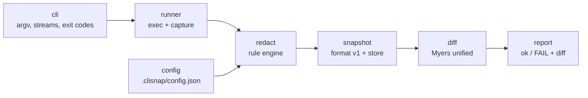

# clisnap

[English](README.md) | [中文](README.zh.md) | [日本語](README.ja.md)

[](LICENSE) [](go.mod) [](CHANGELOG.md)  [](CONTRIBUTING.md)

**clisnap：面向 CLI 的开源快照测试工具——真实命令输出只录制一次，抹除易变噪声，之后每次重跑都干净地 diff。**


```bash
git clone https://github.com/JaydenCJ/clisnap.git && cd clisnap && go install ./cmd/clisnap
```

> 预发布：v0.1.0 尚未发布 module proxy tag，请按上面方式从源码安装。单个静态二进制，零运行时依赖。

## 为什么选 clisnap？

Web 开发者的测试框架天生自带快照测试；CLI 作者却还在手搓"golden file"——然后把日子耗在反复重新祝福它们上，因为真实命令输出里嵌着时间戳、PID、临时路径、home 目录、耗时和内存地址，每次运行、每台机器都不一样。常见的补救比病本身更糟：往测试脚本上焊 `sed` 管道，或者把快照归一化得面目全非、什么都断言不了。clisnap 把"抹除易变量"做成快照自身的一等公民并纳入版本管理：`record` 捕获 stdout、stderr 和退出码，把易变片段改写成 `<TIMESTAMP>`、`<PID>` 这样的稳定 token，并把*用了哪些*规则记进快照——于是 `check` 在任何机器上永远重放完全相同的归一化，出现 diff 就意味着行为真的变了。

| | clisnap | 手搓 golden file | cram / prysk | insta-cmd |
| --- | --- | --- | --- | --- |
| 易变量抹除 | 内置规则 + 自定义正则，逐快照记录 | 每个脚本自己写 `sed`/`grep` | 逐行手写 `(re)` 标记 | 在 Rust 代码里配置过滤器 |
| 被测工具 | 任意可执行文件、任意语言 | 任意 | 任意 | 任意可执行文件，但需从 Rust 测试代码驱动 |
| 运行时依赖 | 无（Go 标准库，单二进制） | 无 | Python + 安装 | Rust 工具链 |
| 断言退出码 + stderr | 始终、且分开断言 | 通常被遗忘 | 退出码有 | 有 |
| 预期变更后重录 | `check --update`，只重写失败项 | 手动覆盖 | `--interactive` | `cargo insta review` |
| 快照在评审中的可读性 | 行前缀文本格式，为 diff 而设计 | 原始转储 | 内联在测试文件里 | 类 YAML 文件 |

<sub>对比基于 2026-07 各上游文档。cram/prysk 的 `(re)` 标记须在每个易变行上手工维护；clisnap 规则作用于全部输出并固定在每个快照内。</sub>

## 特性

- **内置易变量抹除** — 时间戳（RFC 3339、RFC 1123、syslog、裸时钟）、耗时、PID、临时路径、home 目录、十六进制地址、UUID 和 ANSI 码都变成稳定 token；有误伤风险的模式（裸日期、epoch 整数）也提供，但需显式开启。
- **快照跨机器存活** — 当前用户的真实 home 目录不论什么布局都会被抹除，且每个快照记录自己的规则清单，升级永远不会悄悄改变旧快照断言的内容。
- **断言完整契约，而不只是 stdout** — stderr 单独捕获，退出码也是断言的一部分；输出在流之间迁移、或状态码回归，都会让 check 失败。
- **失败信息可读** — 真正的 Myers unified diff，带上下文、git 风格的 `\ No newline at end of file` 标记，以及指向正确行号的 hunk 头。
- **格式为评审而生** — 快照是带版本头、逐行前缀的文本文件，适合提交并在 code review 里阅读；损坏文件会带行号报错，而不是拿垃圾去比较。
- **零依赖、零网络** — 纯 Go 标准库，一个静态二进制；clisnap 只运行你的命令、读写文件，别的什么都不做，自身由 90 个离线测试加端到端 smoke 脚本验证。

## 快速上手

录制一条每次运行输出都不同的命令：

```bash
cat > greet.sh <<'EOF'
#!/bin/sh
echo "greeter 1.0"
echo "started $(date -u +%Y-%m-%dT%H:%M:%SZ) pid $$"
echo "hello, world"
EOF
chmod +x greet.sh

clisnap record greet -- ./greet.sh
clisnap check
```

真实捕获的输出：

```text
recorded greet -> .clisnap/greet.snap (exit 0, 2 redactions)
  redacted: pid×1 timestamp×1
ok      greet
1 snapshot: 1 ok
```

快照是纯文本文件——直接提交。时间戳和 PID 已被抹掉，明天在同事的笔记本上重跑照样通过：

```text
clisnap snapshot v1
cmd: ["./greet.sh"]
exit: 0
redact: ansi,tmp-path,home-path,timestamp,uuid,hex-addr,duration,pid
--- stdout: 3 lines ---
|greeter 1.0
|started <TIMESTAMP> pid <PID>
|hello, world
--- stderr: 0 lines ---
```

当行为真的变了，`check` 以退出码 1 失败并给出 unified diff（改掉问候语后的真实输出）：

```text
FAIL    greet
--- greet.snap stdout
+++ current stdout
@@ -1,3 +1,3 @@
 greeter 1.0
 started <TIMESTAMP> pid <PID>
-hello, world
+hello there, world
1 snapshot: 0 ok, 1 failed
```

预期内的变更用 `clisnap check --update` 接受；也可以把任何东西用 `clisnap redact` 管过引擎，预览一套规则的效果。

## 内置抹除规则

| 名称 | 默认 | 改写对象 | Token |
| --- | --- | --- | --- |
| `ansi` | 是 | ANSI CSI/OSC 转义序列 | *（直接移除）* |
| `tmp-path` | 是 | `/tmp`、`/private/tmp`、`/var/folders`、`/dev/shm` 路径，整体替换 | `<TMP>` |
| `home-path` | 是 | `/home/<user>`、`/root` 及当前用户真实 home——保留尾部路径 | `<HOME>` |
| `timestamp` | 是 | RFC 3339、RFC 1123、syslog 日期、裸 `HH:MM:SS` | `<TIMESTAMP>` |
| `uuid` | 是 | RFC 4122 UUID | `<UUID>` |
| `hex-addr` | 是 | 4–16 位十六进制的 `0x` 字面量（`0xFF` 不受影响） | `<ADDR>` |
| `duration` | 是 | `812ms`、`1.5s`、`1h2m3.5s`（`v1.2s` 不受影响） | `<DURATION>` |
| `pid` | 是 | `pid 123`、`PID: 4`、`pid=77`、syslog `proc[123]:` | `<PID>` |
| `date` | 需开启 | 裸 `YYYY-MM-DD`（常是稳定输出，故不默认开） | `<DATE>` |
| `epoch` | 需开启 | 2017–2033 范围内的 10/13 位 epoch 整数 | `<EPOCH>` |

规则按同一套规范顺序生效，与你列出的顺序无关；替换是幂等的，且每个快照都固定录制时的规则集。细节与设计取舍见 [docs/snapshot-format.md](docs/snapshot-format.md)。

## 配置

可选的 `.clisnap/config.json`，严格解析（未知键即报错）：

| 键 | 默认 | 作用 |
| --- | --- | --- |
| `redact` | 内置默认集 + 全部自定义规则 | 替换新录制使用的规则清单 |
| `rules` | `[]` | 自定义正则规则（`name`、`pattern`、`replace`），先于内置规则生效 |

单次调用控制：`record --redact pid,uuid` 挑选规则，`record --redact none` 原样录制，`record --shell` 给整条管道拍快照，`--dir` 更换快照目录。退出码：`0` 通过，`1` 快照不匹配（或 check 全量时仓库为空），`2` 用法/配置/IO 错误。

## 架构



`record` 从左流到右、止于存储；`check` 重跑命令，用快照自带的规则清单做抹除，再把两份文本交给 differ。

## 路线图

- [x] v0.1.0 — record/check/update/list/show/rm、redact 过滤模式、10 个内置规则 + 自定义规则、严格 v1 格式、Myers unified diff、零依赖、90 个测试 + smoke 脚本
- [ ] `--timeout` 与输出体积上限，防失控命令
- [ ] Windows 支持：路径抹除规则、CRLF 归一化选项
- [ ] `check --json` 机器可读报告，便于 CI 标注
- [ ] stdin 夹具（`record --stdin file`），支持偏交互的工具
- [ ] 可选的 `sha` 规则，抹除输出里的 VCS 哈希

完整清单见 [open issues](https://github.com/JaydenCJ/clisnap/issues)。

## 参与贡献

欢迎 bug 报告、抹除规则的点子和 PR——本地流程见 [CONTRIBUTING.md](CONTRIBUTING.md)（`go test ./...` 加 `scripts/smoke.sh` 打印 `SMOKE OK`）。入门任务标记为 [good first issue](https://github.com/JaydenCJ/clisnap/issues?q=is%3Aissue+is%3Aopen+label%3A%22good+first+issue%22)，设计讨论在 [Discussions](https://github.com/JaydenCJ/clisnap/discussions)。

## 许可证

[MIT](LICENSE)
